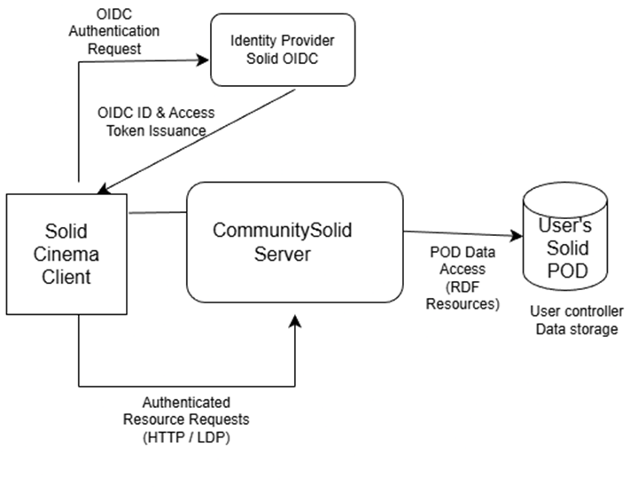

# Solid Cinema
## Introduction
- `Solid Cinema` is a simple Single Page Application developed to demonstrate the complete developer experience of building a Solid application
- This is a [Vue.js](https://vuejs.org/) Single Page Application bootstrapped using [Vite](https://vite.dev/)
- The main functionality of this application is to list all the movies under /movies folder inside an authenticated Solid POD
## Implementation
### Architecture


- [Solid OIDC]() : Used to authorize the application by granting access token to access Solid POD using a configured WebID
- [CSS](https://github.com/CommunitySolidServer/CommunitySolidServer) : Community Solid Server that enables user to create a Pod and WebID
- [Solid POD](https://solidproject.org/get_a_pod) : Personal Online Data Store to store all the user data in a secured, easy to transport manner

### Project Setup
```
solid-cinema-vue
├── package.json
├── vite.config.ts
├── Dockerfile
├── src
│   ├── main.ts
│   ├── App.vue
│   ├── solid.ts
│   └── views
│       └── MoviesList.vue	
```
- Dockerfile : Installs all the NPM dependencies, builds the SPA and runs
- main.ts : Application entry point. Initializes Vue and mounts the app.
- solid.ts : Contains Solid-specific logic such as authentication, session handling, and POD access.
- views/MoviesList.vue : Fetches and displays movie data from the `/movies` folder in the user’s Solid POD.

## Local Development
- To run the application using docker (easiest), run the following command
```shell
docker compose up solid-cinema-vue
```
- To enable hot reload development setup, run
```
npm install
npm run dev
```

## Usage
- Open the application in your browser
- Log in using your Solid WebID
- Grant access permissions when prompted
- The app reads movie data from: `/movies`


Inside your Solid POD, movies are displayed in the UI

Example POD Structure
```
/movies
  ├── movie1.json
  ├── movie2.json
  └── movie3.json
```

Each file can contain metadata such as title, year, genre, etc.